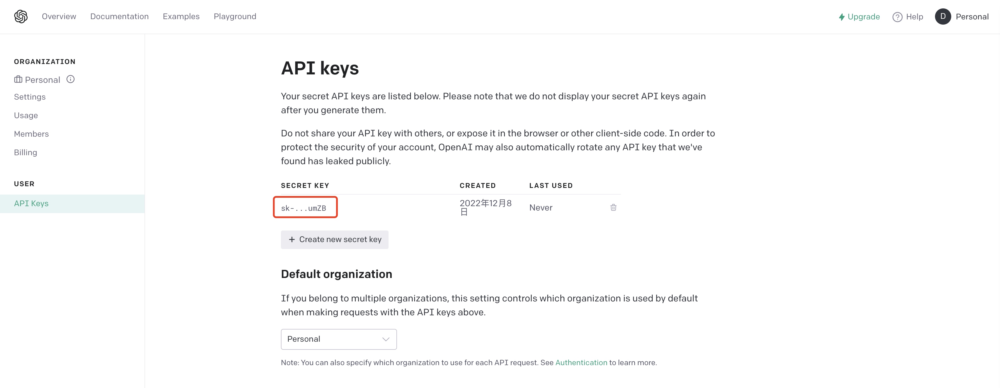

# gpt

openai gpt sdk, written by golang.

## Preparation

login the [openai official website](https://beta.openai.com/account/api-keys), and get your own API_KEY.



## Quick Start

1. install gpt sdk

```shell
go get -u github.com/all-in-aigc/gpt
```

2. request api with gpt client

```go
package main

import (
	"fmt"
	"log"
	"time"

	"github.com/all-in-aigc/gpt"
)

func main() {
	apiKey := "xxx"

	// new gpt client
	cli, _ := gpt.NewClient(&gpt.Options{
		ApiKey:  apiKey,
		Timeout: 30 * time.Second,
		Debug:   true,
		BaseUri: "https://xxx.com/openai", // use a proxy api, default baseuri is https://api.openai.com
	})

	// request api
	uri := "/v1/models"

	res, err := cli.Get(uri)

	if err != nil {
		log.Fatalf("request api failed: %v", err)
	}

	for _, v := range res.Get("data").Array() {
		fmt.Printf("model id: %s\n", v.Get("id").String())
	}
}
```

> see available apis in [OpenAI documents](https://beta.openai.com/docs/api-reference/completions/create)

## Examples

there are some examples under the `examples` folder, check and see how to request other apis.

- [Create chat completion](https://platform.openai.com/docs/api-reference/chat/create)

```go
cli := getClient()

uri := "/v1/chat/completions"
params := map[string]interface{}{
	"model":       "gpt-3.5-turbo",
	"messages":      []map[string]interface{}{
		{"role": "user", "content": "hello"},
	},
}

res, err := cli.Post(uri, params)
if err != nil {
	log.Fatalf("request api failed: %v", err)
}

message := res.Get("choices.0.message.content").String()

fmt.Printf("message is: %s", message)
// Output: xxx
```

- [Create Chat Completion With Function Call](https://platform.openai.com/docs/api-reference/chat/create)

```go
userQuestion := "What is the weather like in Boston?"

uri := "/v1/chat/completions"
params := map[string]interface{}{
	"model": "gpt-3.5-turbo",
	"messages": []map[string]interface{}{
		{
			"role":    "user",
			"content": userQuestion,
		},
	},
	"functions": getFuncs(),
}

res, err := cli.Post(uri, params)
if err != nil {
	log.Fatalf("request api failed: %v", err)
}

funcName := res.Get("choices.0.message.function_call.name").String()
funcArgs := res.Get("choices.0.message.function_call.arguments").String()

if funcName == "" || funcArgs == "" {
	log.Fatalf("function call get args failed: %s", res)
}

fmt.Printf("function call name: %s, args: %v", funcName, funcArgs)
```

- [Create Completion](https://beta.openai.com/docs/api-reference/completions/create)

```go
uri := "/v1/completions"
params := map[string]interface{}{
	"model":       "text-davinci-003",
	"prompt":      "say hello three times",
	"max_tokens":  2048,
	"temperature": 0.9,
	"n":           1,
	"stream":      false,
}

res, err := cli.Post(uri, params)

if err != nil {
	log.Fatalf("request api failed: %v", err)
}

fmt.Println(res.GetString("choices.0.text"))
```

- [Create Edit](https://beta.openai.com/docs/api-reference/edits/create)

```go
uri := "/v1/edits"
params := map[string]interface{}{
	"model":       "text-davinci-edit-001",
	"input":       "Are you hapy today?",
	"instruction": "fix mistake",
	"temperature": 0.9,
	"n":           1,
}

res, err := cli.Post(uri, params)

if err != nil {
	log.Fatalf("request api failed: %v", err)
}

fmt.Println(res.GetString("choices.0.text"))
```

- [Create Image](https://beta.openai.com/docs/api-reference/images/create)

```go
uri := "/v1/images/generations"
params := map[string]interface{}{
	"prompt":          "a beautiful girl with big eyes",
	"n":               1,
	"size":            "256x256",
	"response_format": "url",
}

res, err := cli.Post(uri, params)

if err != nil {
	log.Fatalf("request api failed: %v", err)
}

fmt.Println(res.GetString("data.0.url"))
```

## Communication

- Telegram Group: [all in AIGC](https://t.me/+OtxKWYMf8UE0ZWQ1)

- Discord Server: [all in AIGC](https://discord.gg/qSrsTzuw)
